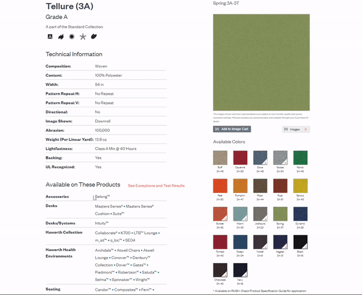

# hw-material-scrapper

Created this program to help automate one of our repetitive work process.
Successfully reduced time from hours to seconds

A program to web scrape JPG files from Haworth website. 
Then get RGB values of the JPG files and output it in a certain format. 
Created the UI using Electron 

Tech Used: JavaScript, HTML, CSS, Electron, Node JS, Express, Cheerio

